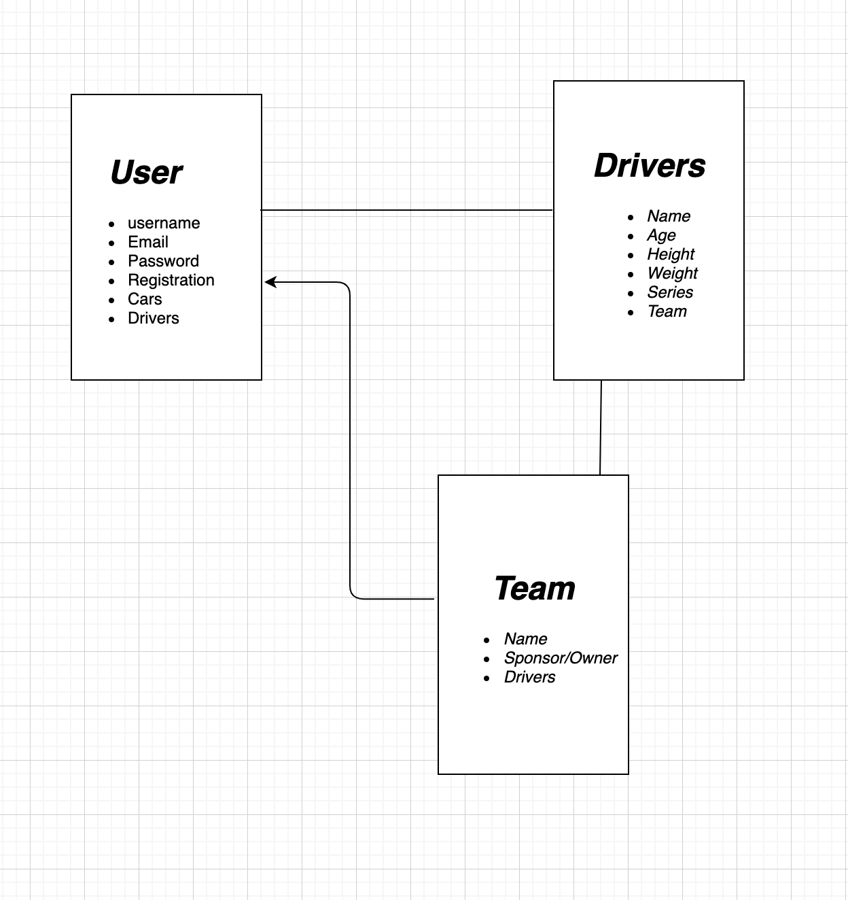

# Capstone_Project

## Intro:

Welcome to my App, RacingNews gathers the information about your favorite Cars, Drivers and teams in the most recent races around the world. Click on the name of any individual driver car or team to view their page full of latest information about them. Once you create an account, you may add teams and players then click on the 'My Feed' tab to view a list of them.

## Technologies:

Node.js
Express
React.js
CSS
HTML

## Wireframe

## ERD

## Functionality

- Register and Login.
- Contact details of the drivers and teams.
- Show an index of pricing of the cars.
- Editable menu from the admin page.

## General Requirements/MVP 

You must create 2 apps: A Node/Express backend and a React frontend that communicate with each other.
Develop a complete product.
Implement thoughtful user stories.
Be deployed online through Heroku

## User Stories

As a user, I should be able to create an account.
As a user, I should be able to view my cars.
As a user, I should be able to access my cars with drivers.
As a user, I should be able to view all the drivers in a team.
