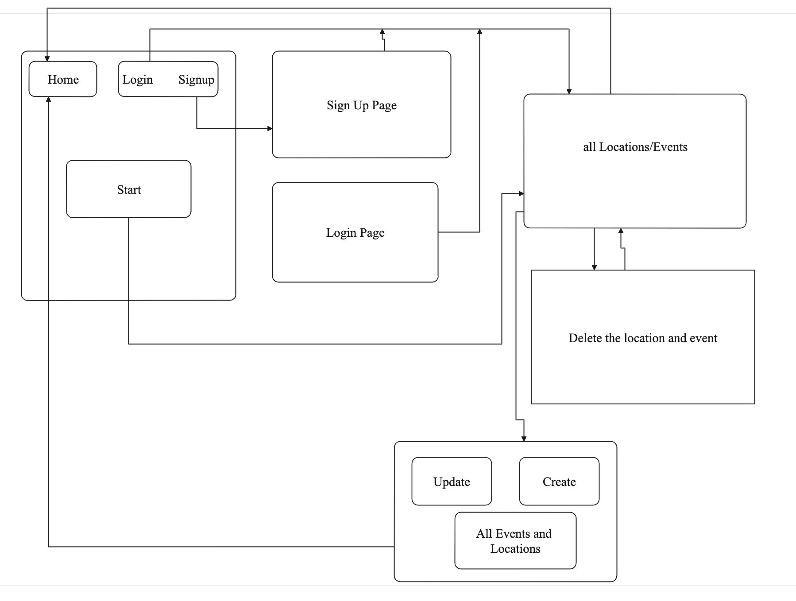

# Capstone_Project

## Introduction:
Welcome to my App, Event Planning gathers all the most recent events around the U.S. Click on the name of any individual locations/cities view the event. Once you create an account, you may add more events and locations then you can always savethoes events on your profile.

## Technologies:
* Node.js
* Express
* React.js
* CSS
* HTML

**Set-up**|**Frontend**|
|--------|----------|
|Create READMD.md file|Created React App|
|Create two Repos (backend and frontend)|Import Data from backend API|
|Create ERD Diagrams|Components: Homepage, All Locations, Event Details, Update Event|

## ERD Diagram:

## App Components

|**Components**|**Description**|
|--------------|---------------|
|Homepage|Main screen includes: Welcome page, method to Login/Signup, and home button|
|Locations|User can see all cities as well as create their specific cities.|
|Create locations|User can create a new city with new events info|
|Update location|User can to update/modify their city name and event info|

## Functionality:

* Register and Login.
* Locations/cities aound the U.S that has events.
* Show all events.

## General Requirements/MVP:

* You must create 2 apps: A Node/Express backend and a React frontend that communicate with each other.
* Develop a complete product. Implement thoughtful user stories.
* Be deployed online through Heroku
